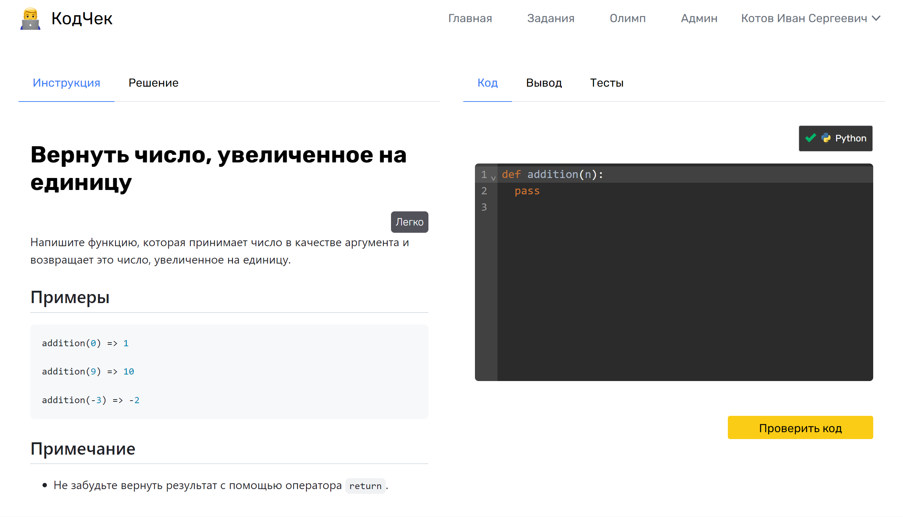
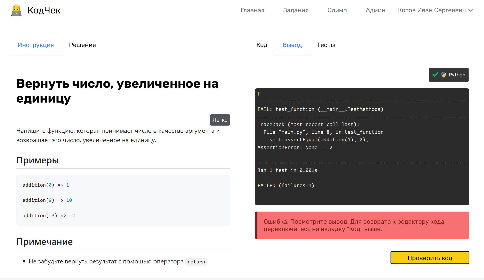
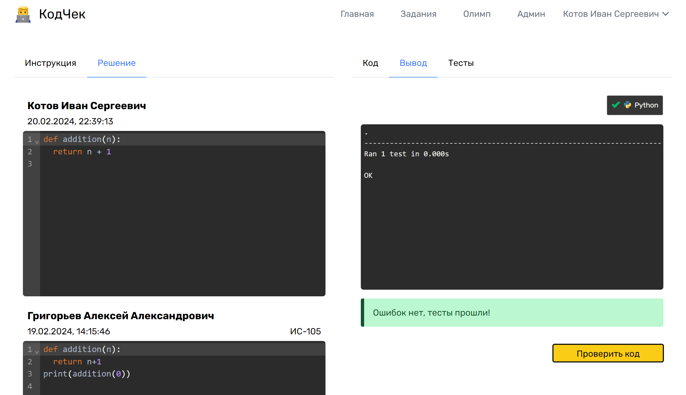

# КодЧек

## Описание

**КодЧек** - платформа для онлайн-практики алгоритмов и задач по программированию.

Перечень основых функциональных возможностей:

- Решение алгоритмических задач на разных языках программирования
- Автоматическое тестирование задач, написанных пользователем
- Авторизация по данным из д.ркэ.рф
- Поиск заданий по названию

Для администратора доступно добавление, редактирование и удаление заданий в системе.

## Технологии

- JavaScript/TypeScript (Nuxt 3)
- PostgreSQL
- [Judge0](https://judge0.com/) (Платформа позволяющая безопасно запускать код в изолированном режиме)

## Права в приложении:

USER - авторизованный пользователь
ADMIN - обладает всеми возможными привилегиями

## Развертывание

### Docker

Проект можно развернуть с помощью Docker. Для упрощения работы с запуском контейнеров созданы два файла, организовывающих работу всех контейнеров: `docker-compose.prod.yml` и `docker-compose.dev.yml`.

#### `docker-compose.prod.yml`

Этот файл отвечает за запуск всех контейнеров, необходимых для работы всего приложения, и специально оптимизирован для работы на реальном сервере.

Чтобы стартовать приложение в режиме `production`, необходимо в корне проекта запустить следующую команду:

`docker compose -f docker-compose.prod.yml up -d --build`

В результате чего на localhost пробросятся 3 порта

1. `:80` - само приложение
2. `:2358` - Judge0
3. `:5432` - база данных PostgreSQL

> :information_source: **Примечание**
>
> При первом развертывании проекта, необходимо будет создать БД codecheck внутри контейнера, где запущенных postgres, после чего заполнить эту БД с помощью команды `npx prisma migrate deploy` (запускать внутри контейнера, где запущено само приложени

#### `docker-compose.dev.yml`

Второй файл создан с целью ведения локальной разработки на своей машине, поддерживающей Docker. В результате ее работы пробрасывается два порта на localhost:

1. `:5432` - база данных PostgreSQL
2. `:15432` - postgresAdmin
3. `:2358` - Judge0

> При этом само приложение в режиме разработки, вы должны запускать на хост машине с помощью команды `npm run dev`, а для этого у вас должен быть установлен NodeJS
